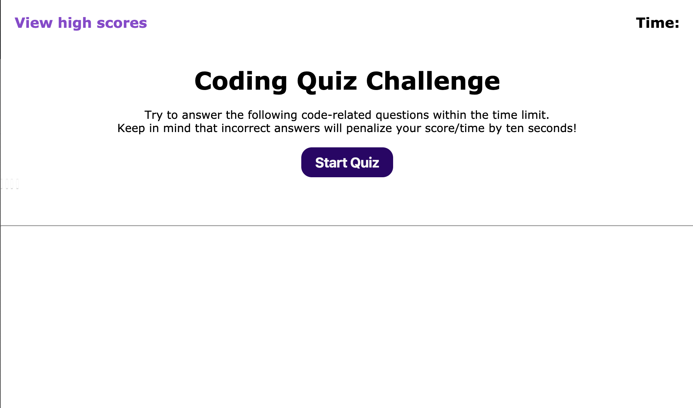

# Coding Quiz

## Purpose
A coding quiz pertaining to content about all coding related subjects and lessons I have covered so far in UT coding bootcamp course up until week 4.  This will help me become familiar with these types of tests, and give me a chance to apply the skills from this week's module.

## Built with
* HTML
* CSS
* JS

## Link to webpage
https://saul10huerta.github.io/coding-quiz/

### Contribution
Made by Saul Huerta